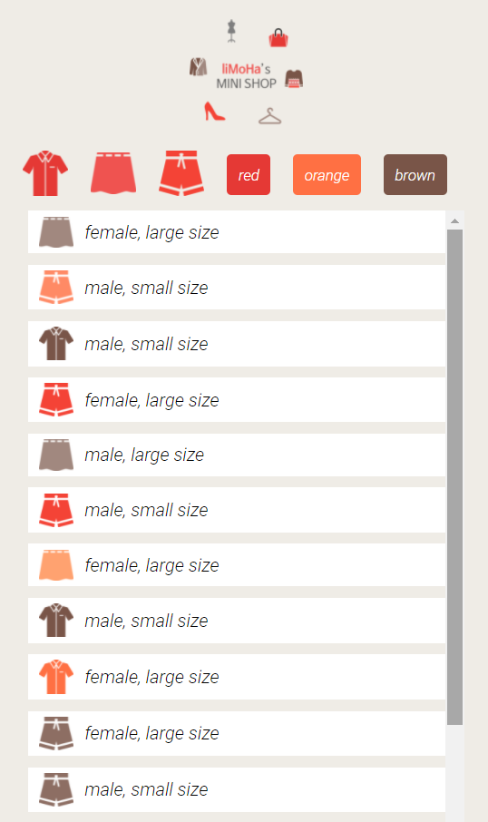

# mini shopping mall - dynamic web page

동적으로 데이터를 받아와서 화면에 표시하는 연습을 했다. 가장 먼저 DOM에 대한 이해와 DOM트리에 대한 이해가 필요했다. 이후 web API에는 무엇이 있는지 찾아보았고 이중 데이터를 받아오는 API인 fetch를 사용하는 방법을 공부했다.

---

## ✅결과물

### fetch로 json 객체 받아와서 화면에 표시

