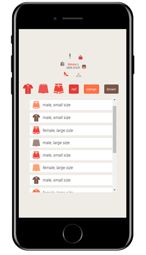

# mini shopping mall - dynamic web page

동적으로 데이터를 받아와서 화면에 표시하는 연습을 했다. 가장 먼저 DOM에 대한 이해와 DOM트리에 대한 이해가 필요했다. 이후 web API에는 무엇이 있는지 찾아보았고 이중 데이터를 받아오는 API인 fetch를 사용하는 방법을 공부했다. fetch를 이해하기 위해서는 Promise의 개념 또한 이해할 필요가 있었다. 마지막으로 버튼을 클릭했을 때 각 버튼에 맞게 필터링 될 수 있도록 filter 함수를 사용했다.

---

## ✅결과물

메인 로고 포함 7가지 버튼을 클릭하면 각 버튼에 맞게 옷들이 필터링 돼서 화면에 표시된다. 메인 로고는 전체 옷을 표시하는 버튼이다.

