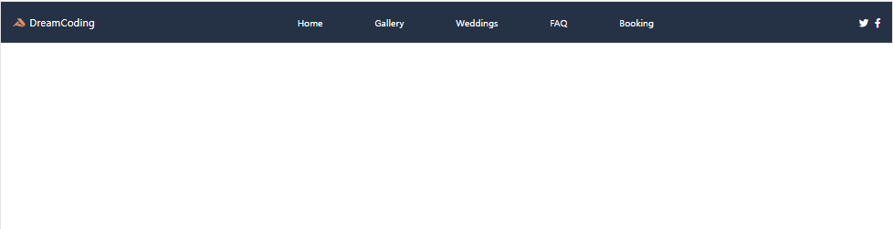
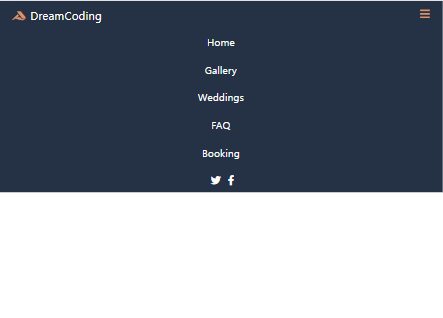

# responsive header 

이 헤더는 예전에 만들어 본 적이 있는데 이때는 flex도 잘 모르고 그냥 아무것도 모르는 상태에서 제작했던 거라 처음부터 다시 만들어봤다. 예전보다는 확실히 구조 작성하는 게 수월해진 것 같다. css는 아직 모르는 속성들이 많아서 구글링하면서 작성하고 있다. js 이용해서 이벤트도 적용시켜봤다.

---

결과물

## layout1

## layout2

## 🔗실행링크
https://limoha.github.io/Ellie-Youtube/responsiveHeader/src/
